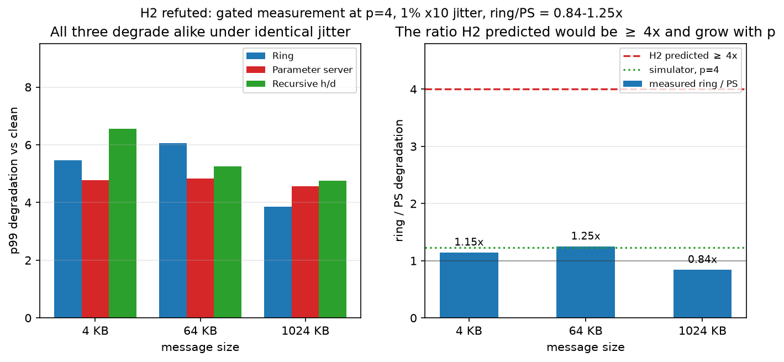
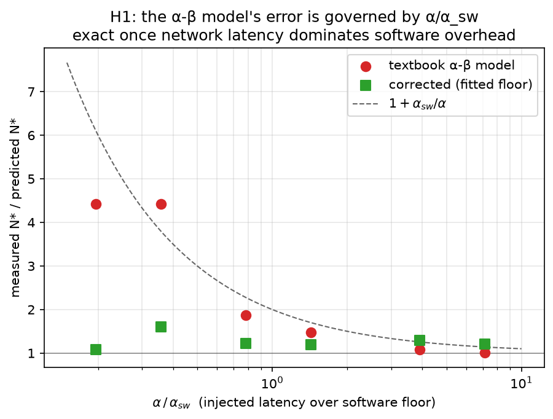
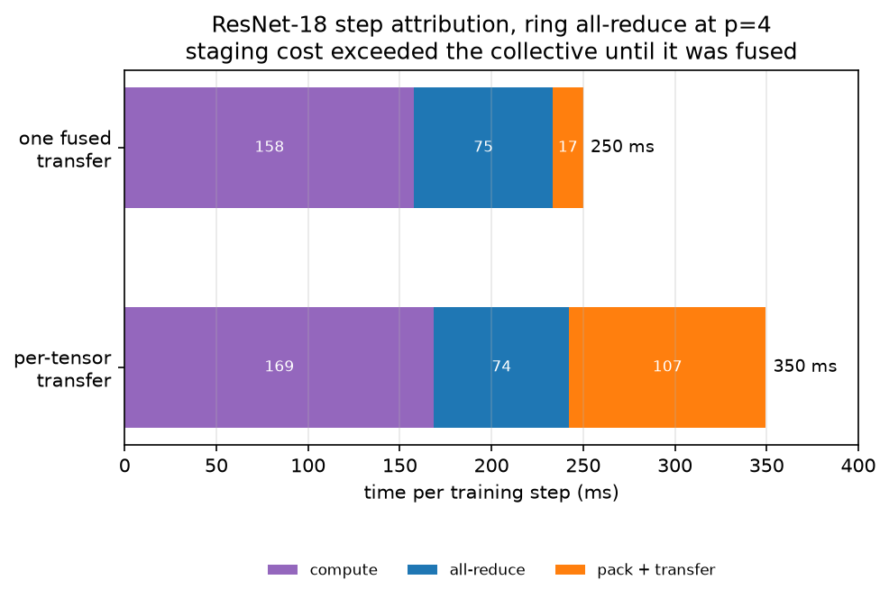
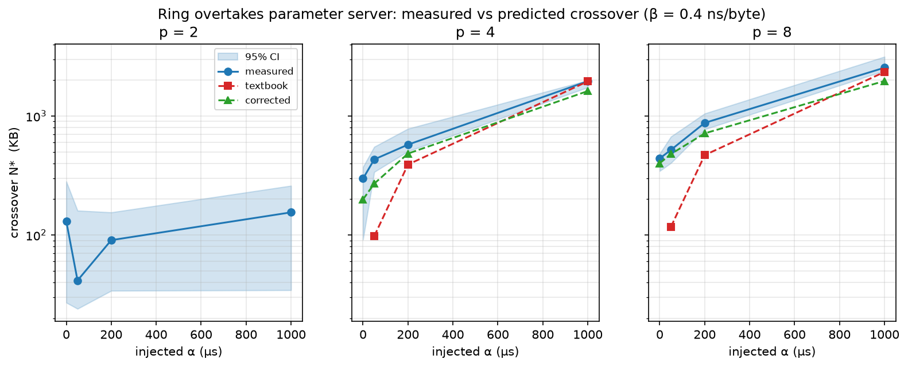

# Crossover surfaces in data-parallel gradient synchronization

Ring all-reduce, recursive halving/doubling, and a parameter server implemented
from scratch over a point-to-point transport, benchmarked on a testbed where the
network's latency (α) and inverse bandwidth (β) are **controlled variables**
rather than whatever the loopback interface happens to provide.

The project tests two falsifiable hypotheses about when each strategy wins.
**One is refuted at the margin, one is refuted outright** — findings 1 and 2
below. Findings 3 and 4 came out of building the apparatus to test them, and
finding 3 turned out to be the most useful of the four. The write-ups treat the
refutations as the result rather than something to bury.

## Findings

### 1. The α-β model's error is governed by α/α_sw — not a constant

The textbook α-β model is the standard justification for ring all-reduce. Swept
across four orders of magnitude of injected latency, its error predicting the
ring/PS crossover is **4.43× when α ≪ α_sw and exactly 1.00× when α ≫ α_sw**,
where α_sw is the per-step software overhead (Python dispatch, buffer
management, substrate cost) measured independently at α = β = 0.

This explains *when to trust the model rather than whether to*: MPI collectives
in C over InfiniBand sit at α/α_sw ≫ 1 where the model is exact; Python-level
frameworks sit below 1, where it misprices the crossover by over 4×.

A second, sharper failure: with no injected bandwidth term the textbook model
predicts ring can **never** beat PS. Measured, ring wins above 1.85 MB at p=4 —
the model gets the sign wrong, because it assumes a zero per-byte cost while any
real machine has one (here 40–87 Gbit/s effective).

Refitting with the independently measured floor brings predictions to within
**8–60% (median 22%)**. → [`docs/findings-h1.md`](docs/findings-h1.md)

### 2. Ring all-reduce is *not* more jitter-fragile — and the apparatus could not have shown it either way

The hypothesis was that ring's 2(p−1) serially dependent steps would amplify tail
latency ≥4× more than a parameter server's p steps. A **gated measurement at p=4**
gives ring/PS = **1.15–1.25×** (and 0.84× at 1 MB — ring degrading *less*), against
a predicted ≥4×. The simulator independently predicts 1.23× at p=4 and 1.08× at
p=8, flat in p.

The reasoning error was treating a longer dependency chain as pure exposure. It
is also accumulation: more steps make the clean baseline larger, so a fixed
straggler perturbation is a *smaller relative* inflation. The corollary inverts
the original intuition — recursive halving/doubling, with the **fewest** steps,
is the most tail-fragile in ratio terms (4.00× at p=64 vs ring's 1.43×).

Getting to a measurement at all took an engineering change. The shim spin-waited,
consuming a core per worker, which is what capped the apparatus. Sleeping for a
*fraction* of each delay rather than a fixed slack — the overshoot is proportional,
so 0.7 × 1.35 < 1 — holds identical accuracy (0.03–0.33% median error) at **11–15%
CPU instead of 99%**, taking the apparatus from **5/36 to 19/36** usable
configurations and putting p=4 in range.

Before that change, **only 5 of 36 configurations could support a p99 claim** — at p ≥ 4 the machine's
own clean p99/p50 is 2–10×, and 75% of a p=8 measurement is contention between
co-located processes. That gap existed because the Week 1 calibration validated
the delay shim under spin contention *with no payload*. The hypothesis was
therefore tested against a discrete-event model of the dependency graph,
validated against measurement where the apparatus is clean (**8/10 agreement,
median error 6%**) and explicitly labelled indicative elsewhere (3/26, 160%).
→ [`docs/findings-h2.md`](docs/findings-h2.md)

### 3. The collective was worth 3.2% of a training step until the staging was fixed

Ring's 1.78× microbenchmark win over the parameter server on ResNet-18's 44.7 MB
gradient buffer was initially worth **3.2%** of an actual step, because
flattening gradients into the contiguous buffer cost *more than the all-reduce
itself* (107 ms vs 74 ms) — and that cost is identical for every algorithm.

The cause was one device-to-host transfer per parameter tensor: 62 small
crossings at 23.4 ms, against 7.8 ms for a single fused one (on CPU both are
~1 ms, so it is the boundary, not the packing). Packing into a device-side
buffer and crossing once made staging **6.4× faster**, cut step time **28.5%**,
and raised the value of choosing the right collective from 3.2% to **9.7%**.

The staging fix was worth roughly three times what the best collective choice
was worth. The cheapest win was not in the algorithm under study.
→ [`docs/findings-e2e.md`](docs/findings-e2e.md)

### 4. A crossover quoted as a single message size is underspecified

At ResNet-18's gradient size — 50× above every measured crossover — ring beats
the parameter server by **1.78× at β=0.4 ns/byte**, but the **parameter server
wins at p ≥ 4 when β=0.05** (a fast intra-node link), by up to 1.31×. When
bandwidth is plentiful the per-step software floor dominates and PS's p steps
beat ring's 2(p−1). → [`docs/findings-workload.md`](docs/findings-workload.md)

## Things I got wrong, and what caught them

Each of these changed a number I had already written down. They are logged with
the measurement that killed them in [`docs/decisions.md`](docs/decisions.md).

| What I believed | What killed it |
|---|---|
| The parameter server costs `2α`, as the textbook quotes it. | A smoke test came out 4.5× off. Under a shared uplink the server pays α per outbound copy, so it is `p·α`. Left in, it would have manufactured a 2× "model error" attributed to H1 that had nothing to do with H1. |
| Recursive halving/doubling is slower because it allocates a 22 MB buffer per step. | An interleaved, trial-paired A/B found **no difference at any configuration**. The 10–30% "regression" I first measured was machine drift between two separate runs. |
| Then: it is slower because 22 MB blocks blow the cache. | Measured directly — effective bandwidth **plateaus** at 0.19 ns/byte from 2 MB to 64 MB, no turnaround. Refuted. The gap is still unexplained and is logged as open, not attributed to a third guess. |
| `time.sleep` is unusable for delay injection, so the shim must spin. | Right about `sleep`, wrong about the remedy. The overshoot is *proportional*, not absolute, so sleeping a **fraction** of each delay is safe: same accuracy at 12% CPU instead of 99%. That took usable configurations from 5/36 to 19/36 and turned H2 from a model prediction into a measurement. |
| A p=3 configuration was too noisy to measure (7.23×). | Docker Desktop was running a 12-CPU VM in the background. Idle, the same configuration measured **1.44×** — a 5× difference from background load. Caught only because a previously-measured point had drifted. |

The apparatus is now gated: configurations the calibration and noise-floor
experiments ruled out raise at load time rather than producing a plausible
number. Two of the corrections above would have been silent without it.

## Figures

| | |
|---|---|
|  |  |
| **H2 refuted** by a gated measurement: ring/PS = 1.15–1.25× against a predicted ≥4×. | **H1**: the α-β model's error is governed by α/α_sw, reaching 1.00× once network latency dominates. |
|  |  |
| Gradient staging cost more than the collective until 62 device transfers were fused into one. | Measured vs predicted crossover: the textbook model diverges at low α and converges at high α. |

Others in [`figures/`](figures/): the software-overhead floor, the apparatus
noise floor, the simulated degradation curve, and the bandwidth plateau that
refuted one explanation for recursive halving/doubling's slowness.

## What is actually built

| | |
|---|---|
| `src/dpt/collectives/` | Ring, recursive halving/doubling, and parameter-server all-reduce, written from scratch over `isend`/`irecv` |
| `src/dpt/transport/shaped.py` | Injects a controlled α + N·β link cost, accurate to 0.4% median (see below) |
| `src/dpt/simulate.py` | Discrete-event model of each algorithm's message DAG |
| `src/dpt/bench/` | Declarative sweeps, cold-launch trials, long-format output |
| `src/dpt/analysis/` | Floor fitting, bootstrap crossover CIs, noise profiling, simulator validation |
| `src/dpt/train/` | ResNet-18 / CIFAR-10 data-parallel training with a pluggable collective and per-phase step attribution |

## Measurement design

The parts that took the most care, and the reasoning behind each, are logged in
[`docs/decisions.md`](docs/decisions.md). The load-bearing ones:

- **Delay injection sleeps a fraction, then spins.** `time.sleep` overshoots by
  a consistent +20–30% at *every* scale — a proportional bias, not a granularity
  floor — so a *fixed* slack fails at large delays (+17.7% at 5 ms). Sleeping a
  *fraction* of each delay is safe at every scale (0.7 × 1.35 < 1) and holds the
  same ≤0.4% median error as pure spinning at 11–15% CPU instead of 99%.
  Granularity is measured at runtime and the sleep leg is skipped where the
  platform cannot deliver it — ~5 µs on macOS but ~1 ms inside a VM, where a
  140 µs sleep would overrun its deadline fivefold.
- **Worker count is capped empirically, not assumed.** At p=12 (spinners =
  cores) the scheduler starves and p99 error reaches +112%.
  → [`docs/calibration.md`](docs/calibration.md)
- **The shim is validated against a real shaped link.** On Linux with `tc netem`,
  the shim is linear in configured α with **slope 1.004, R² = 1.0000**; netem is
  linear at slope 2.090. The ~2× gap appears independently in bandwidth
  (netem's β is 2.05–2.13× nominal), identifying it as double traversal of the
  loopback qdisc: **1 µs of shim α ≡ 2.08 µs of netem delay**.
  → [`docs/netem-validation.md`](docs/netem-validation.md)
- **A trial is a process launch, not an iteration.** Confidence intervals
  bootstrap over cold spawns, so they carry launch-to-launch variance.
- **Jitter keys on (worker, step), not message index.** Ring sends 2(p−1)
  messages per collective and PS sends 2, so message *k* is not comparable
  across arms; "rank *r* is slow during step *s*" is algorithm-independent and
  makes the comparison properly paired.
- **Crossovers are fitted, not eyeballed.** Each arm is fitted as a line in N
  and the intersection solved analytically, with bootstrap CIs.
- **The software floor is fitted per worker count**, because it grows with p
  through resource contention (1.55–1.99×) rather than slowest-of-p gating
  (1.02–1.11×) — a distinction the per-rank data settles.
  → [`docs/floor.md`](docs/floor.md)
- **A/B comparisons run interleaved inside one sweep, never across runs.** A
  variant that looked 10–30% slower across separate runs showed **no difference
  at any configuration** when paired by cold launch — the gap was machine drift.
- **Guardrails are code, not prose.** Configurations the calibration and
  noise-floor experiments ruled out (jitter below α=200 µs, p > 8) raise at load
  time rather than producing a plausible-looking number.

## Correctness

```bash
pytest tests/          # 102 tests
```

- Every collective matches gloo's `all_reduce` to 1e-9 at p ∈ {2,4,8}, including
  message sizes indivisible by the world size.
- Data-parallel training reproduces the single-process loss trajectory to
  **5e-5** across all three collectives (2–5e-2 accumulated over an 80-step
  CIFAR-10 run, which converges 2.367 → 1.901).
- BatchNorm's *expected* breaking of that equivalence is asserted as a test, so
  the docs fail loudly if it ever changes: each rank normalises over its own
  shard (8 samples at p=4, not 32), so trajectories diverge before any gradient
  is exchanged. GroupNorm is used for the exact gate.

## Reproducing

```bash
pip install -e .

python -m dpt.bench.calibrate                              # timer fidelity gate
python -m dpt.bench.sweep --config experiments/floor.yaml  # software floor
python -m dpt.bench.sweep --config experiments/h1_grid.yaml
python -m dpt.bench.sweep --config experiments/noise_floor.yaml
python -m dpt.bench.sweep --config experiments/h2_jitter.yaml

python -m dpt.analysis.fit          # floor + contention decomposition
python -m dpt.analysis.crossover    # H1: measured vs predicted
python -m dpt.analysis.noise        # where tail statistics are admissible
python -m dpt.analysis.validate     # simulator vs measurement
python -m dpt.analysis.figures

python -m dpt.train.resnet_cifar --workers 4 --collective ring
python -m dpt.train.compare --workers 4     # per-phase step attribution
```

Sweeps write long-format CSVs to `results/` (one row per config/trial/iteration/
rank); every figure and every number in `docs/` is generated from those files.

## Limitations

- Workers are processes on one machine, so the software floor includes
  contention a real cluster would not have. It is absorbed per-p rather than
  left in the comparison, but it caps what can be claimed at p ≥ 4.
- H2 is measured at p=4 and modelled beyond it. The discrete-event model is
  validated against measurement at p=2 and p=4; its p=8 and p=64 predictions are
  extrapolation. H2 was stated at p=8, so settling it as written still needs a
  machine that passes the gate there.
- The two-point jitter model quantises simulated p99 onto discrete levels; a
  continuous heavy-tailed distribution would smooth it.
- The shim is validated against `tc netem` at 4–32 ms and against wall clock at
  250 µs–2 ms, but **not directly against netem at the 50 µs–1 ms the experiments
  actually use** — netem's delay quantizes to ~1 ms in a Docker VM, so that range
  is below its usable resolution. The claim rests on the shim's measured
  linearity (R² = 0.9999) rather than a direct comparison at 50 µs; confirming it
  would need bare-metal Linux with a high-resolution timer.
- Reaching p=8 needs more cores, not a cluster — the blocker is spin-wait
  contention, not network realism. Four cheaper local routes were tried. One
  worked (fractional sleep, which bought p=4); the rest were refuted: replacing
  spinning outright (VMs quantize sleep to ~1 ms, worse than macOS) and smaller
  worker counts (p=3 fails on launch-to-launch p99 stability even at 10 trials ×
  400 iterations). `./scripts/settle_h2.sh 8` on a 32-vCPU machine runs it behind
  a gate that refuses to proceed if the apparatus still cannot support it.
  → [`docs/scaling-up.md`](docs/scaling-up.md),
  [`docs/codespaces.md`](docs/codespaces.md)

## Environment

Apple M4 Pro (12 cores, 24 GB unified), macOS 25.6, Python 3.13, PyTorch 2.13
with the gloo backend; MPS for training compute. Point-to-point messaging is
gloo's; every collective algorithm is this project's.
